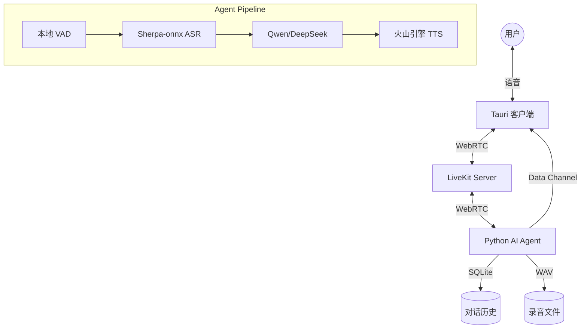

# MiniH LiveKit - AI 实时语音交互系统


**MiniH LiveKit** 是一个低成本、跨平台、低延迟的 AI 实时语音交互系统。该项目采用 Client-Server-Agent 架构，结合了本地极致优化的 ASR 和云端强大的 LLM/TTS 能力，旨在为用户提供类似于 GPT-4o 的实时语音对话体验，同时大幅降低运行成本。

## 🌟 核心特性

- **跨平台支持**：基于 **Tauri v2** 构建，支持 macOS、Windows、Linux 桌面端，以及 iOS 和 Android 移动端。
- **混合云架构 (Hybrid Architecture)**：
  - **本地计算 (Edge)**：使用 CPU 运行 Sherpa-onnx 进行流式 ASR (语音转文字)，无需昂贵的 GPU。
  - **云端智能 (Cloud)**：灵活接入 OpenAI 兼容的 LLM (如 DeepSeek, Qwen) 和高质量 TTS (如火山引擎/豆包)。
- **极低延迟**：基于 **LiveKit** (WebRTC) 进行实时通信，配合流式处理管道，实现自然流畅的对话打断和响应。
- **实时字幕**：通过 Data Channel 推送 ASR 和 LLM 结果，前端实时显示对话内容。
- **通话录音**：双声道 WAV 录音（用户左声道/AI 右声道），支持会话回放。
- **对话历史**：SQLite 持久化存储，支持历史会话检索。
- **现代化技术栈**：Rust + React + Rsbuild 前端，Python 异步 Agent 后端。

## 🏗 系统架构



详细设计请参考 [系统架构设计文档](docs/design.md)。

## 🛠 技术栈

| 模块         | 技术选型        | 说明                             |
| ------------ | --------------- | -------------------------------- |
| **应用框架** | Tauri v2        | 跨平台核心，Rust 驱动            |
| **前端框架** | React + Rsbuild | 极速构建，Cyber-Teal UI 设计     |
| **实时通信** | LiveKit         | WebRTC SFU 服务                  |
| **AI Agent** | livekit-agents  | 基于 AgentSession 的标准化架构   |
| **ASR**      | Sherpa-onnx     | 本地 CPU 实时语音识别            |
| **LLM**      | OpenAI API 兼容 | 支持 Qwen、DeepSeek 等任意大模型 |
| **TTS**      | Volcengine      | WebSocket V1 二进制协议流式合成  |
| **数据库**   | SQLite          | 对话历史持久化                   |

更多技术细节请参考 [技术栈详解](docs/tech-stack.md)。

## 🚀 快速开始

### 前置要求

- **Docker & Compose**: 用于运行 LiveKit Server。
- **Node.js** (v20+): 用于前端开发。
- **Rust** (v1.77+): 用于 Tauri 构建。
- **Python** (v3.10+): 用于运行 AI Agent。
- **uv**: 推荐的 Python 包管理工具。

### 1. 启动 LiveKit Server

```bash
cd server
docker compose up -d
```

### 2. 配置环境变量

在 `agent/` 目录下创建 `.env` 文件：

```env
LIVEKIT_URL=ws://localhost:7880
LIVEKIT_API_KEY=devkey
LIVEKIT_API_SECRET=devsecret_minih_livekit_2026_secure_key

# LLM 配置 (任选一个)
LLM_BASE_URL=https://dashscope.aliyuncs.com/compatible-mode/v1
LLM_API_KEY=your_api_key
LLM_MODEL=qwen3-max

# TTS 配置 (火山引擎)
VOLCENGINE_APP_ID=your_app_id
VOLCENGINE_ACCESS_TOKEN=your_token
```

### 3. 启动 AI Agent

```bash
cd agent
uv sync                  # 安装依赖
uv run main.py dev      # 启动开发模式
```

> **注意**: 首次运行需按照 [技术栈文档](docs/tech-stack.md) 下载 ASR 模型文件至 `agent/src/models/`。

### 4. 启动客户端 App

```bash
cd app
npm install              # 安装依赖
npm run dev             # 启动 Web 开发模式
# 或
npm run tauri dev       # 启动 Tauri 桌面应用
```

## 📂 项目结构

```text
minih-livekit/
├── docs/               # 项目文档 (设计、进度、技术栈)
├── server/             # LiveKit 服务端 Docker 配置
├── agent/              # Python AI Agent
│   └── src/
│       ├── agent_impl.py    # 核心入口
│       ├── plugins/         # VAD/STT/LLM/TTS 适配器
│       └── services/        # 录音/数据库/Token服务
└── app/                # Tauri + React 客户端源码
```

详细目录结构说明请参考 [架构文档](docs/architecture.md)。

## 📅 项目进度

当前处于 **Phase 6: Agent Session 集成修复与增强**。

- [x] 核心链路验证 (ASR -> LLM -> TTS)
- [x] Web 客户端原型
- [x] Tauri 桌面端集成
- [x] 系统托盘实现
- [x] 双声道录音模块
- [x] 对话历史与实时字幕
- [x] AgentSession 标准化架构
- [x] Data Channel 实时推送
- [-] 移动端适配 (iOS 已构建, Android 跳过)

详细进度记录请阅读 [progress.md](docs/progress.md)。

## 📄 文档索引

- [design.md](docs/design.md) - 系统设计与方案
- [architecture.md](docs/architecture.md) - 目录结构与文件说明
- [tech-stack.md](docs/tech-stack.md) - 技术栈与开发指南
- [implementation_plan.md](docs/implementation_plan.md) - 详细实施计划
- [progress.md](docs/progress.md) - 开发进度与验证记录
